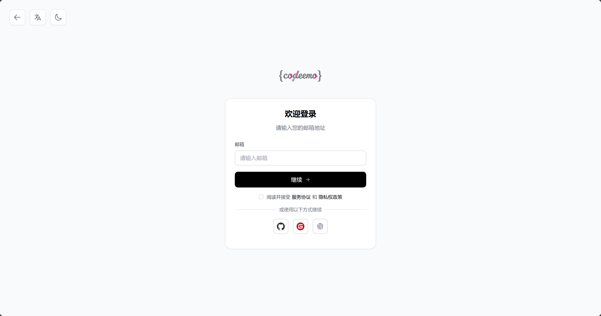

# WebRTC Meeting Application

这是一个基于WebRTC的多人在线会议应用，支持音视频通话、屏幕共享、实时聊天和文件传输。

演示地址：https://meeting.codeemo.cn

个人博客：https://www.codeemo.cn


## 🚀 功能特性

- 🎥 **音视频通话**: 高质量的音视频通信
- 🖥️ **屏幕共享**: 实时屏幕共享功能
- 💬 **实时聊天**: 通过WebRTC DataChannel实现的文本消息
- 📁 **文件传输**: 通过WebRTC DataChannel实现的P2P文件传输
- 👥 **多人会议**: 支持多人同时参与会议
- 📱 **响应式设计**: 适配桌面和移动设备

## 🛠️ 技术栈

### 前端

- Vue 3 + TypeScript
- Pinia (状态管理)
- WebRTC API
- Vite (构建工具)

### 后端

- Go + Gin
- WebSocket信令服务器
- Coturn

## 🚀 快速开始

### 1. 启动后端服务器

```bash
cd server
go run ./ serve
```

### 2. 启动前端应用

```bash
cd web
npm install
npm run dev
```

### 3. 或使用一键启动脚本

```bash
npm run dev
```

然后可以输入`s`或者`w`来重启`server`和`web`

## 😄 部署

### coturn server

项目地址：https://github.com/coturn/coturn

coturn 服务器用于提供 TURN (Traversal Using Relays around NAT) 服务，主要帮助 WebRTC 等应用在 NAT 环境下实现媒体流的传输。coturn
服务器需要开放以下端口：

- 3478：默认的 STUN/TURN 协议端口，用于 UDP 和 TCP。
- 5349：用于 TLS/DTLS 连接的端口。
- 49152 - 65535：这是一个范围，用于分配给客户端的 UDP 转发端口。这个范围可以根据实际需求进行配置。

配置示例

在 turnserver.conf 配置文件中，可以指定这些端口：

```text
listening-port=3478
tls-listening-port=5349
min-port=49152
max-port=65535
```

*配置*

```
realm=turn.codeemo.cn #开放端口，修改成你自己的域名
```

*启动*

```
/usr/bin/turnserver -c /etc/turnserver.conf
```

注意事项

- 防火墙设置：确保防火墙允许上述端口的流量通过。
- 安全性：建议使用 TLS/DTLS 加密连接，以提高安全性。
- 端口范围：根据实际需求调整 min-port 和 max-port 的值，确保有足够的端口供客户端使用。

### 构建

使用下方命令构建前后端应用

```
make
```

构建后服务端二进制文件在`bin`目录下，后端应用需要配置`server/config.toml`
，修改数据库连接，由于未开发登录页面，所以使用同意授权登录，通过配置passport实现，相关配置需要前往[CodeEMO](https://www.codeemo.cn/login?redirect_uri=https%3A%2F%2Fwww.codeemo.cn%2Fuser%2Fcenter)
申请

### 登录 （使用第三方授权登录或者邮箱验证码登录自动注册）



### 登录成功后自动跳转到个人中心，点击oauth应用菜单


### 点击右上角创建应用，输入名称和回调地址


### 创建完成后会获得客户端ID和客户端密钥

前端应用会输出到server/public目录下，前端应用需要配置env.production

### nginx 配置

[nginx.conf](nginx.conf)

## 🌐 访问地址

- 前端应用: http://localhost:5173
- 后端API: http://localhost:8080
- WebSocket: ws://localhost:8080/api/websocket

## 🤝 贡献

欢迎提交Issue和Pull Request！

## 📄 许可证

MIT License